# Lovecraft
This project is about the life and works of H.P. Lovecraft. It contains useful information for both fans of and people new to Lovecraft's works. 
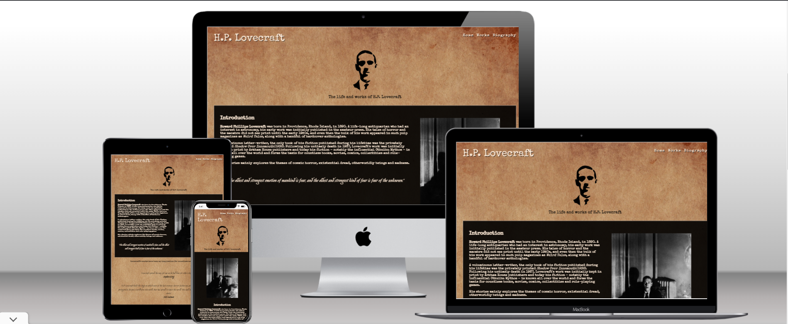
## Features
In the top left corner we have our header and in the top right corner we have our navigation section, with links to the three pages being Home, Works, and Biography. Centered we have a silhouette of Lovecraft with a subheading.  

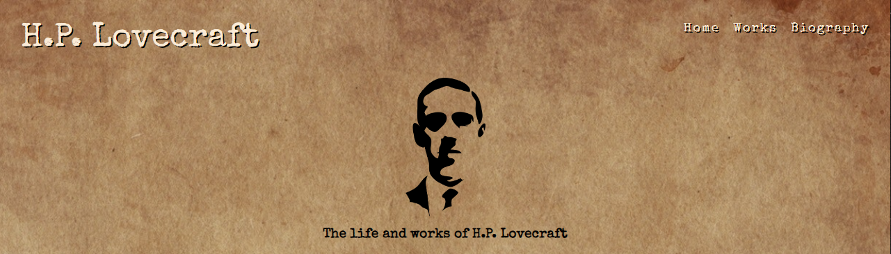

### Home 
- The front page features a short introduction to Lovecraft next to a photograph of him from around 1930. Under the introduction is a famous quote of his that perfectly describes his literature and philosophies.  

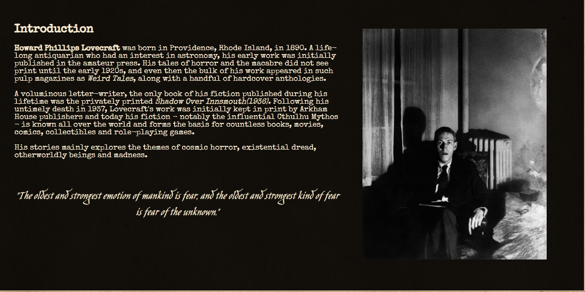
- Below we find some quotes about Lovecraft from different authors that he inspired.  

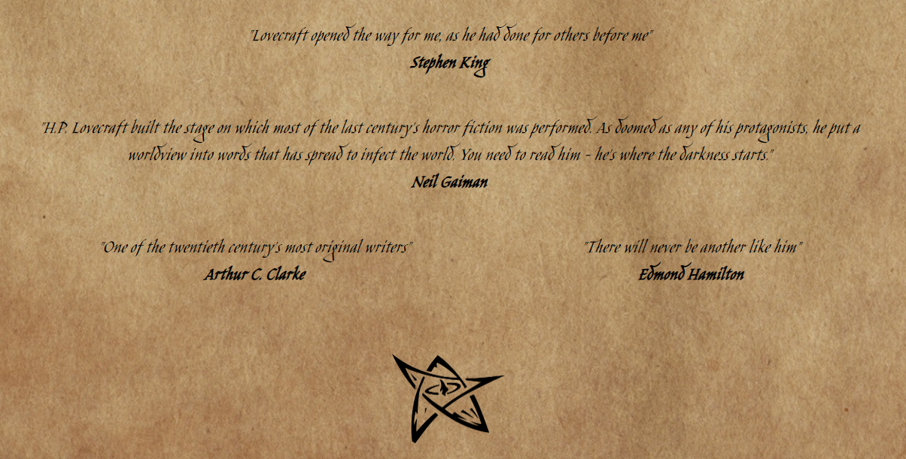
- Also featured here is a form for the user to fill in if they want to sign up to the newsletter.

- At the bottom of the page is our footer with links to Goodreads, LibriVox and Wikipedia. There is also an arrow icon to take the user back to the top of the page.  

### Works
- On the Works page the user will first see the Works of Horror section, or if they have a larger viewport, both the works of horror section and the Cthulhu Mythos section will be visible side by side.  

- The Works of Horror section features a short description of his writings followed by a list of his horror fiction stories. At the bottom there's a link to Lovecraft's complete bibliography on Wikipedia, which opens in another tab.  
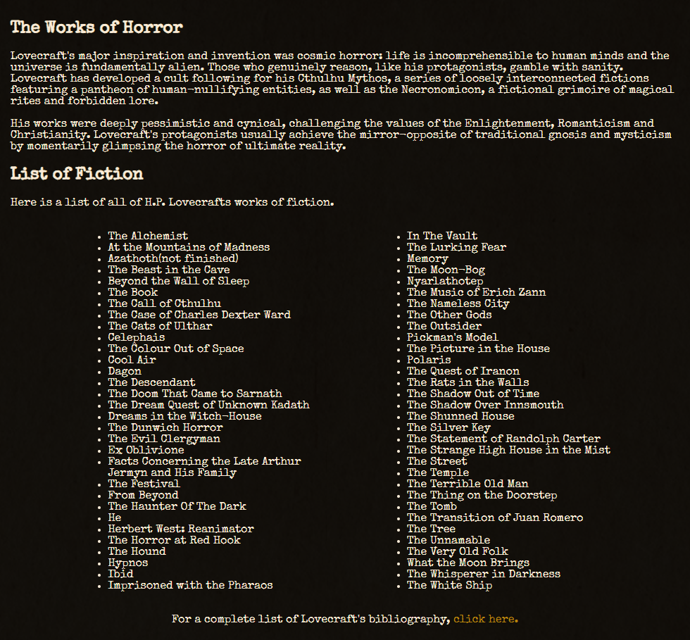

- The Cthulhu Mythos section features a picture of Cthulhu and a description of what the mythos is.  

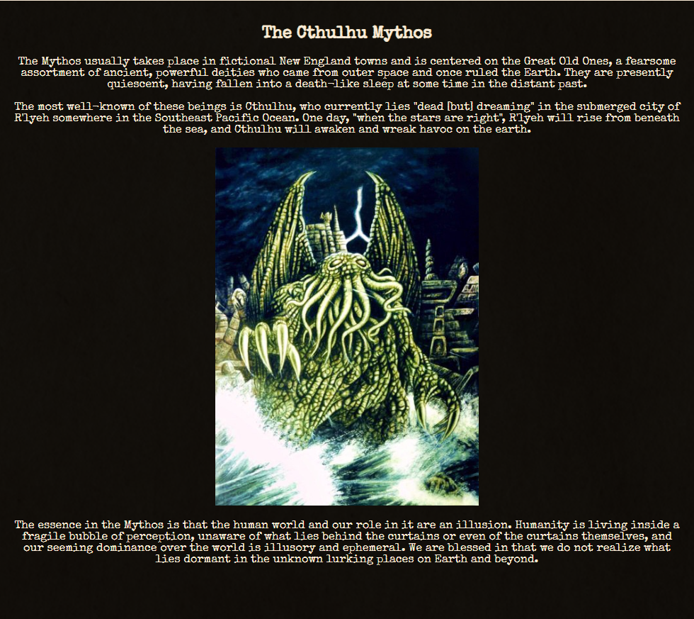 

- Below these two sections is an audioplayer with an audiobook of The Nameless City - provided by LibriVox, Public Domain, via Wikimedia.  

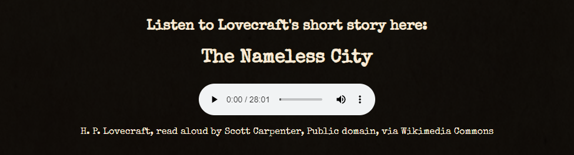 

- At the end of this page is a quote that the user will recognise from the audiobook provided above. 

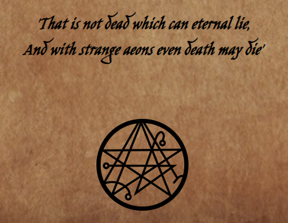

### Biography
- The Biography page features a matching structure to the home page, with text about Lovecraft next to a portrait from 1934.  
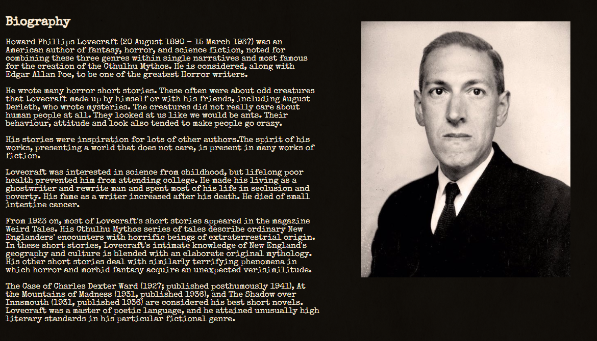
- At the bottom there's another quote followed by a symbol.  
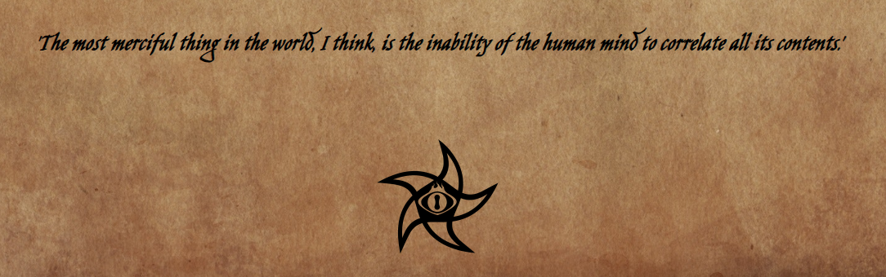  

### Future Features
Future features might include making more options for audio and text material provided such as having a short story on the page together with the audiobook so that users can read along and choose among stories.

## Testing
*All tests had a positive outcome unless stated otherwise*  
- Audioplayer and all the links, including the sign-up form, was tested in all the following browsers/devices and worked as intended.  

    - Tested in Chrome with responsive device mode.
    - Tested in Firefox.
    - Tested in Edge.
    - Tested on my phone (Samsung A224G) with Chrome and Samsung Internet.
    - Tested on friends phone (Samsung S6 Edge) with Chrome.  
- Tested different sizes to make sure the website was responsive and all breakpoints worked as intended as well as being presented correctly. For instance, the 'Works' page lets users with wider screens be presented with both the 'Works of Horror' section and the 'Cthulhu Mythos' section positioned next to each other, while users with narrower screens and tablets get presented with the 'Works of Horror' section first, 'Cthulhu Mythos' second. Mobile users recieve a similar experience with a smoother layout without borders.  

### Unfixed Bugs  
I do not have any unfixed bugs that I am aware of.

## Audit in Google Lighthouse:  
### Home  
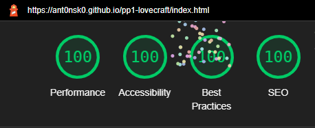  
### Works  
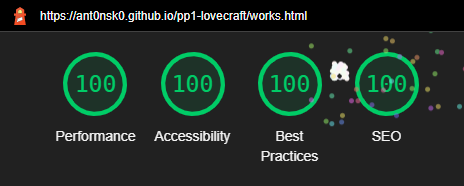  
### Biography  
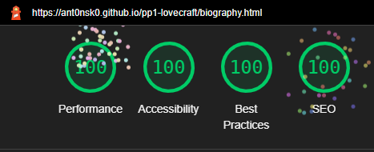

Lighthouse was run in Chrome incognito mode as recommended by various sources such as [Intellitonic](https://intellitonic.com/blog/google-lighthouse/) and [Flexiple](https://flexiple.com/developers/using-google-lighthouse-to-audit-your-web-application/)  
I did find it a bit inconsistent between audits, especially between using incognito or not. 
## Validator Testing
- HTML - There is no errors going through [W3C HTML Validator](https://validator.w3.org/) 
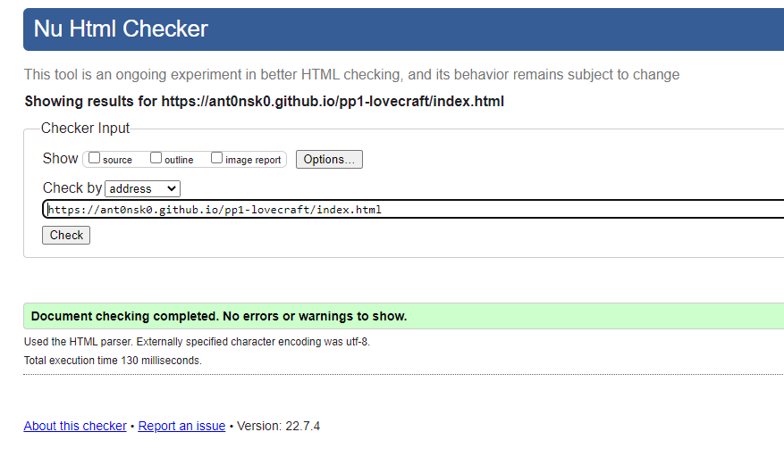 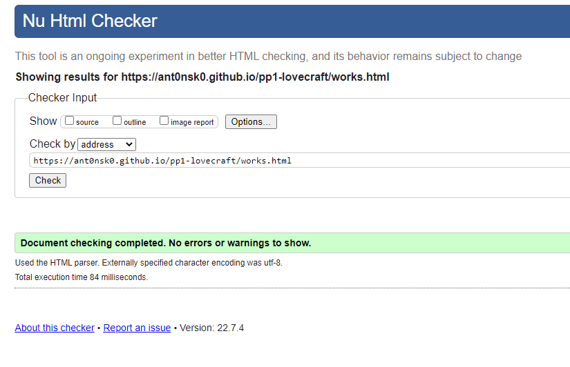 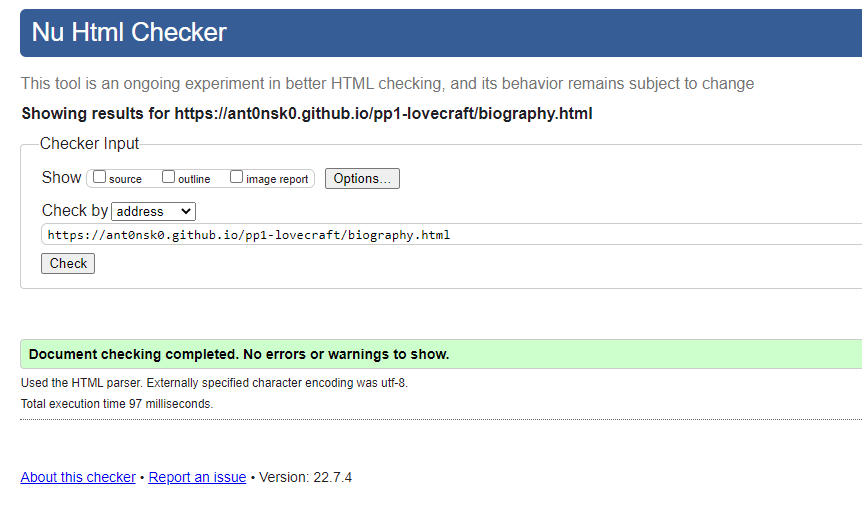  

    - I had initially one error/warning because I had used a span instead of div. Simple solution to replace the span with the necessary div.
- CSS - There is no errors going through [W3C CSS Validator](https://jigsaw.w3.org/css-validator/validator)
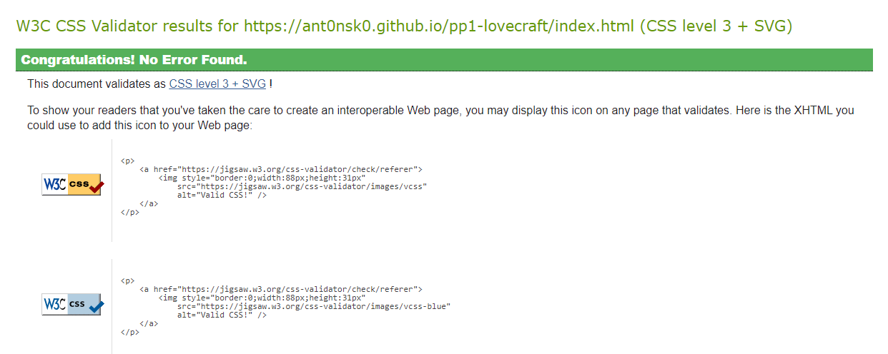  

## Deployment  
This project was deployed to GitHub Pages.  
To do so:  
1. Go to the repository on GitHub.  
2. Click on "Settings".  
3. On this page scroll down to find "Pages" located in the bar to the left.  
4. Click "Source" and choose "main".  
5. Click on "Save"
6. A link will show up, wait for it to load and then click on it to go to the deployed page.  
Live link can be found here: https://ant0nsk0.github.io/pp1-lovecraft/index.html  

## Credits 

- Learning about grid and flex thanks to my mentor Ronan McClelland, who sent me [this](https://webdesign.tutsplus.com/articles/flexbox-vs-css-grid-which-should-you-use--cms-30184) article and video from Adi Purdila. 

### Contents  

- Introduction text comes from the last page of the Necronomicon Commemorative Edition - it is not made clear who wrote that part but it should be credited to either Stephen Jones or Jeffrey Andrew Weinstock.  

- Biography text comes from [Wikipeda](https://en.wikipedia.org/wiki/H._P._Lovecraft), [Simple Wikipedia](https://simple.wikipedia.org/wiki/H._P._Lovecraft) and [Britannica](https://www.britannica.com/biography/H-P-Lovecraft)  

- Cthulhu Mythos text comes from [Lovecraft Fandom](https://lovecraft.fandom.com/wiki/Cthulhu_Mythos)

- List of works taken from [Simple Wikipedia](https://simple.wikipedia.org/wiki/H._P._Lovecraft)

- Formdump come from Code Institute `<form method="POST" action="https://formdump.codeinstitute.net/">`

- Icons come from [FontAwesome](https://fontawesome.com/)

- Fonts come from [Google Fonts](https://fonts.google.com/)
    

### Media  

- Audiofile comes from LibriVox via [Wikimedia Commons](https://commons.wikimedia.org/wiki/File:LibriVox_-_nameless_city_lovecraft_sc.ogg). Read aloud by Scott Carpenter.

- Photos of H.P. Lovecraft and Cthulhu comes from [Wikimedia Commons](https://commons.wikimedia.org/wiki/H._P._Lovecraft)

- Silhouette comes from [Pixabay](https://pixabay.com/vectors/howard-humphrey-lewis-lovecraft-1295254/)

- Background comes from [Pexels](https://www.pexels.com/photo/empty-brown-canvas-235985/)

- Symbols come from pngwing: [1](https://www.pngwing.com/en/free-png-tmtsj) [2](https://www.pngwing.com/en/free-png-ndimc) [3](https://www.pngwing.com/en/free-png-iuxau)

## Acknowledgements

- I'd like to give a huge thank you to my mentor Ronan McClelland for his enormous help and support during this project.  

- Also thanks to Kenan Wright for continuously providing useful information.