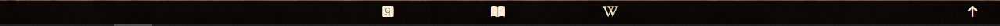

# Lovecraft
This project is about the life and works of H.P. Lovecraft. It contains useful information for both fans and people new to Lovecraft's works. 

## Features
In the top left corner we have our header and in the top right corner we have our navigation section, with links to the three pages being Home, Works, and Biography. Centered we have a silhouette of Lovecraft with a subheading.  

### Home 
- The front page features a short introduction to Lovecraft next to a photograph of him from around 1930. Under the introduction is a famous quote of his that perfectly describes his literature and philosophies.

- Below we find some quotes about Lovecraft from different authors that he inspired.  

- Also featured here is a form for the user to fill in if they want to sign up to the newsletter.

- At the bottom of the page is our footer with links to Goodreads, LibriVox and Wikipedia. There is also an arrow icon to take the user back to the top of the page.

### Works
- On the Works page the user will first see the Works of Horror section, or if they have a larger viewport, both the works of horror section and the Cthulhu Mythos section will be visible side by side.  

- The Works of Horror section features a short description of his writings followed by a list of his horror fiction stories. At the bottom there's a link to Lovecraft's complete bibliography on Wikipedia, which opens in another tab.  

- The Cthulhu Mythos section features a picture of Cthulhu and a description of what the mythos is.  
 
- Below these two sections is an audioplayer with an audiobook of The Nameless City - provided by LibriVox, Public Domain, via Wikimedia.  
 
- At the end of this page is a quote that the user will recognise from the audiobook provided above.  

### Biography
- The Biography page features a matching structure to the home page, with text about Lovecraft next to a portrait from 1934.  

- At the bottom there's another quote followed by a symbol.  

## Testing
*All tests had a positive outcome unless stated otherwise*  
- Tested in Chrome with responsive device mode.
- Tested in Firefox.
- Tested in Edge.
- Tested on my phone (Samsung A224G) with Chrome and Samsung Internet.  
- All links were tested in all browsers mentioned above. All worked as intended.
- Tested in Google Lighthouse:  
### Home  
  
### Works  
  
### Biography  

Lighthouse was run in Chrome incognito mode as recommended by various sources such as [Intellitonic](https://intellitonic.com/blog/google-lighthouse/) and [Flexiple](https://flexiple.com/developers/using-google-lighthouse-to-audit-your-web-application/)  
I did find it a bit inconsistent between audits, especially between using incognito or not. 
## Validator Testing
- HTML - There is no errors going through [W3C HTML Validator](https://validator.w3.org/) 
    - I had initially one error/warning because I had used a span instead of div. Simple solution to replace the span with the necessary div.
- CSS - There is no errors going through [W3C CSS Validator](https://jigsaw.w3.org/css-validator/validator)